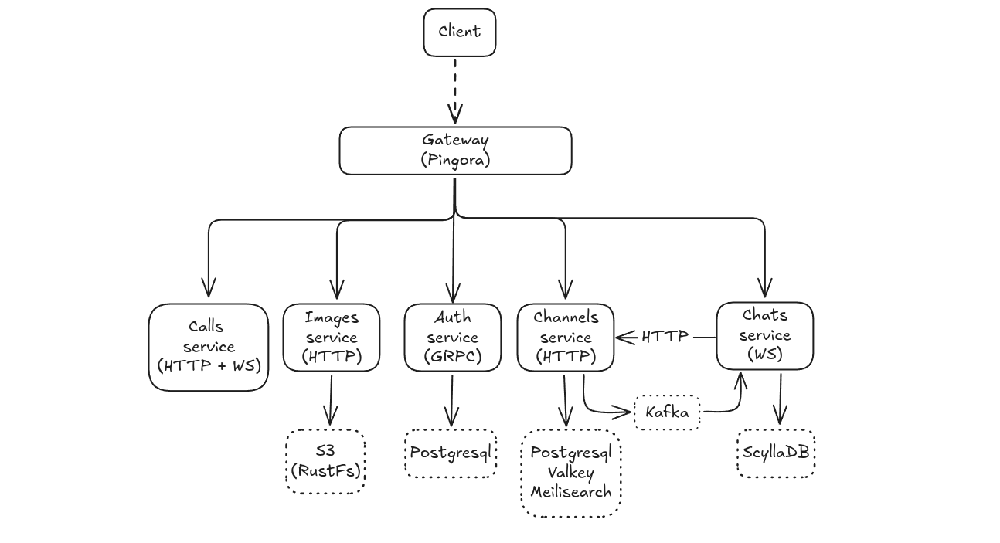

# Rust service

Microservice backend for FuelCommunication messenger. Rust workspace with 6 services and 4 shared infrastructure crates.

## Architecture



## Services

| Service | Port | Protocol | Storage                                  | Description |
|---------|------|----------|------------------------------------------|-------------|
| **service-gateway** | 8080 | HTTP  | -                               | API gateway. Routes traffic, authenticates requests via gRPC call to auth, translates REST `/access/*` endpoints to gRPC, handles CORS and rate limiting |
| **service-auth** | 50051 | gRPC    | PostgreSQL                      | Authentication. Register, login, JWT access/refresh tokens, OAuth 2.0 (Google, GitHub), token cleanup |
| **service-images** | 3005 | HTTP   | S3 (RustFs), Kafka              | Image storage. Upload via multipart, download, delete. S3 for blobs, Kafka for event streaming |
| **service-chats** | 3002 | HTTP/WS | ScyllaDB                        | Real-time messaging. WebSocket per chat room, message persistence in ScyllaDB, subscription verification via service-channels |
| **service-channels** | 3003 | HTTP | PostgreSQL, Valkey, Meilisearch | Channel management. CRUD, subscriptions, ownership transfer, full-text search, cache-aside caching |
| **service-calls** | 3004 | HTTP/WS | In-memory                       | Video/audio calls. WebRTC signaling server (SDP/ICE relay), mesh P2P rooms up to 4 peers |

## Shared crates

| Crate | Description                                                    |
|-------|----------------------------------------------------------------|
| **s3-client**       | S3-compatible object storage client (RustFs/AWS) |
| **kafka-client**    | Kafka producer/consumer wrapper                  |
| **scylladb-client** | ScyllaDB session and message store               |
| **valkey-client**   | Valkey (Redis-compatible) cache client           |

## Docker build

All builds use multi-stage Dockerfiles with `scratch` base image for minimal container size.

```bash
# Build all services
docker build -t service-gateway:latest -f service-gateway/Dockerfile .
docker build -t service-auth:latest -f service-auth/Dockerfile .
docker build -t service-images:latest -f service-images/Dockerfile .
docker build -t service-chats:latest -f service-chats/Dockerfile .
docker build -t service-channels:latest -f service-channels/Dockerfile .
docker build -t service-calls:latest -f service-calls/Dockerfile .
```
